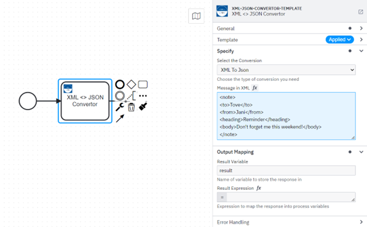
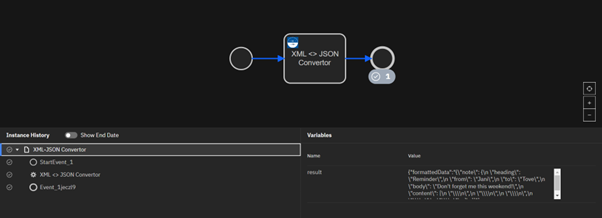
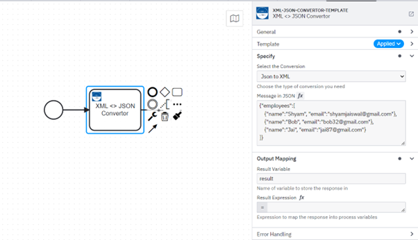
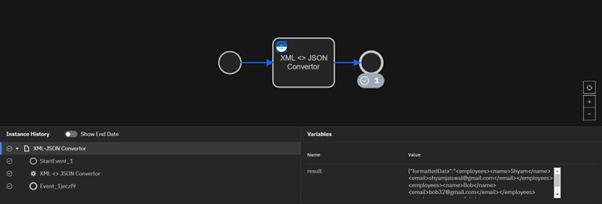

# XML <-> JSON Data Conversion Custom Connector for Camunda

Introducing a tailored Camunda Outbound Connector for seamless conversion between XML and JSON data formats.

This custom Camunda Outbound Connector offers a powerful solution for seamless XML to JSON and JSON to XML data conversion. With user-friendly functionality, it provides a dropdown selection enabling you to effortlessly choose between converting from JSON to XML or vice versa. Once your preferred conversion direction is selected, an intuitive message input box appears, allowing you to conveniently input the data in the desired format - whether it's XML or JSON.

Upon input selection, the connector processes the data using its robust conversion engine. The result is presented in a well-structured formattedData output, ensuring consistency and accuracy in your converted data.

Experience hassle-free XML and JSON data conversion with this versatile Camunda connector, streamlining your workflow and data manipulation tasks.

Camunda Workflow for Effortless XML to JSON Data Conversion:


Formatted Data Result Presented as JSON in Operate:


Camunda Workflow for Effortless JSON to XML Data Conversion:


Formatted Data Result Presented as XML in Operate:



## Runtime 

Build a jar file with dependencies

```bash
mvn clean package
```
Build an image by using the Dockerfile 

```Dockerfile
FROM camunda/connectors:0.22.1

COPY target/xml-json-connector-0.1.0-SNAPSHOT-with-dependencies.jar /opt/app/
```
Command for Building an Image 

```bash
docker build -t xml-json-image .
```

## Docker Compose  

- In this scenario, We are utilizing the self-managed version of Camunda 8, and we have created a corresponding Docker Compose file.

- You can utilize the `docker-compose.yaml` file to start a local connector runtime by using the below command:

```bash
docker compose up
```

## Sample BPMN

You can find the sample BPMN file in the `bpmn` folder of this directory.

## API

### Connector Properties

This Connector can be configured with the following properties:

| Name              | Description                                                                                                                                                                                                                  | Example | Can be a secret |
|-------------------|------------------------------------------------------------------------------------------------------------------------------------------------------------------------------------------------------------------------------|---------|-----------------|
| choice            | Selected Conversion Direction: XML to JSON or JSON to XML | `xmlToJson` | No             |
| messagesInXml | Message Box for input in XML format | `<xml>Any XML Data</xml>`| No              |
| messagesInJson | Message Box for input in JSON format | `{"data": "Any JSON data"}`| No              |

### Output

This Connector produces the following output:

(For conversion from XML to JSON)

```json
{"formattedData":"{JSON_OUTPUT}"}
```
(For conversion from JSON to XML)

```json
{"formattedData":"<xml_output> </xml_output>"}

```

## Test locally

Run unit tests

```bash
mvn clean verify
```

### Test with local runtime

Use the [Camunda Connector Runtime](https://github.com/camunda-community-hub/spring-zeebe/tree/master/connector-runtime#building-connector-runtime-bundles) to run your function as a local Java application.

In your IDE you can also simply navigate to the `LocalContainerRuntime` class in test scope and run it via your IDE.
If necessary, you can adjust `application.properties` in test scope.

## Element Template

The element templates can be found in the element-templates directory.